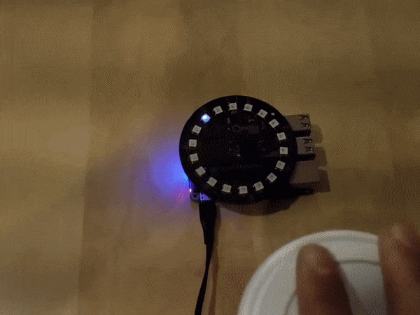

# Sound Localization for MATRIX Creator Using ODAS
## Hardware
### To make the matrix and odas works we need:
  - **Raspberry** Pi 4 Model B+. 
  - **MATRIX Creator Rev 2**  With 8 microphones and 35 LEDs.
  - **USB Power adapter** from 2.5A to 3A.
  - **Micro SD-Card** 16GB with **Rasbian Buster** version 20-06-2019 installed.
  - **Keyboard | Mouse** for the first time to connect to the network and enable SSH.

### Device Installation
  - Insert flashed microSD card into Raspberry Pi
  - Attach MATRIX Creator onto Raspberry Pi GPIO pins
  - Power Raspberry Pi with micro USB power supply
  - [Read more](https://matrix-io.github.io/matrix-documentation/matrix-creator/device-setup/)

## Install Matrix Software
Matrix HAL allow us to write a low level programs in C++ which is needed to run the ODAS Software
[key update](https://community.matrix.one/t/pubkey-not-available/3265)
```batch
# Add Repository and Key
curl https://s3.amazonaws.com/apt.matrix.one/doc/apt-key.gpg | sudo apt-key add -
echo "deb https://apt.matrix.one/raspbian $(lsb_release -sc) main" | sudo tee /etc/apt/sources.list.d/matrixlabs.list

# Update packages and install
sudo apt-get update
sudo apt-get upgrade -y

# Installation
sudo apt install matrixio-creator-init
sudo apt install libmatrixio-creator-hal
sudo apt install libmatrixio-creator-hal-dev
sudo reboot

```

After reboot, install the MATRIX Kernel Modules as follows:

```batch
sudo apt install matrixio-kernel-modules
sudo reboot
```

## Install ODAS Prerequisites

You will need CMake, GCC and the following external libraries:

```batch
sudo apt-get install g++ git cmake
sudo apt-get install libfftw3-dev
sudo apt-get install libconfig-dev
sudo apt-get install libasound2-dev
sudo apt install libjson-c-dev
```

## Installing ODAS

Clone the ODAS project:

```batch
git clone https://github.com/introlab/odas.git
```

Create a folder to build the project and build it:

```batch
cd odas
mkdir build
cd build
cmake ..
make
```

## Run the demo!

You need to run two applications. The `odaslive` that performs all the cool audio processing and the `matrix-odas` that receives the result and draws it in the MATRIX Everloop.

```batch
cd ~/odas/bin
./matrix-odas &
./odaslive -vc ../config/matrix-demo/matrix_creator.cfg
```

Make some noise! ... you should see a blue lights indicating where the sound is coming from.


## References
 - [Direction of Arrival for MATRIX Voice/Creator Using ODAS](https://www.hackster.io/matrix-labs/direction-of-arrival-for-matrix-voice-creator-using-odas-b7a15b#team)
 - [Matrix Documentation](https://matrix-io.github.io/matrix-documentation/matrix-hal/overview/)
 - [ODAS: Open embeddeD Audition System](https://github.com/introlab/odas)
